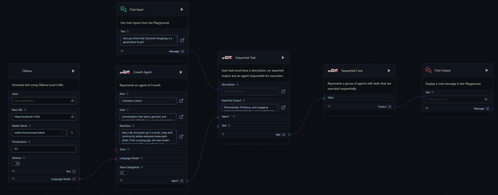

# DateABot



## Visão Geral

O **DateABot** é um projeto que simula um chat entre uma pessoa e um bot, onde o usuário interage com o bot sem saber que está conversando com uma inteligência artificial. O foco é criar uma experiência de chat romântico e envolvente, utilizando uma arquitetura hexagonal para garantir a separação de responsabilidades e facilitar a manutenção e evolução do projeto.

## Arquitetura

O projeto adota a **Arquitetura Hexagonal**, garantindo que os componentes principais do sistema (como domínios e casos de uso) estejam isolados das dependências externas (como banco de dados e serviços HTTP). Isso facilita a substituição ou modificação dessas dependências sem impactar o núcleo do sistema.

### Componentes Principais:
- **PrimaryAdapters**: Contém a API principal e configurações do SignalR para WebSocket.
- **SecondaryAdapters**: Inclui serviços auxiliares, como o serviço HTTP que se conecta ao bot no Langflow.
- **Domain**: Contém as entidades principais e abstrações do sistema, como usuário, bot, e chat.
- **Testes**: Inclui testes unitários para garantir a qualidade e funcionalidade do código.

## Comunicação

- **WebSocket**: A comunicação com o bot (hospedado no Langflow) é realizada via WebSocket, utilizando SignalR para gerenciar conexões em tempo real.
- **HTTP**: As operações de CRUD (Create, Read, Update, Delete) para entidades como Usuário, Bot, e Chat são realizadas via requisições HTTP.

## Testes

Testes unitários foram implementados para validar as funcionalidades principais do sistema, garantindo a confiabilidade do projeto. As pastas `Application` e `Domain` incluem testes específicos para cada caso de uso e entidade.

## Instalação

1. Clone o repositório:
   ```bash
   git clone https://github.com/marcelog5/date-a-bot-backend
   ```
2. Navegue até o diretório do projeto:
   ```bash
   cd dateabot
   ```
3. Configure o ambiente conforme necessário, editando o `appsettings.json`.
4. Execute o projeto:
   ```bash
   dotnet run
   ```

## Contribuição

Sinta-se à vontade para contribuir com o projeto! Faça um fork do repositório e submeta um pull request com suas melhorias.

## Modelo Utilizado

Para melhorar as interações românticas e personalizadas, foi utilizado o modelo **reefer/monicamaxlvl** no Langflow, garantindo uma experiência mais envolvente e realista nas conversas.